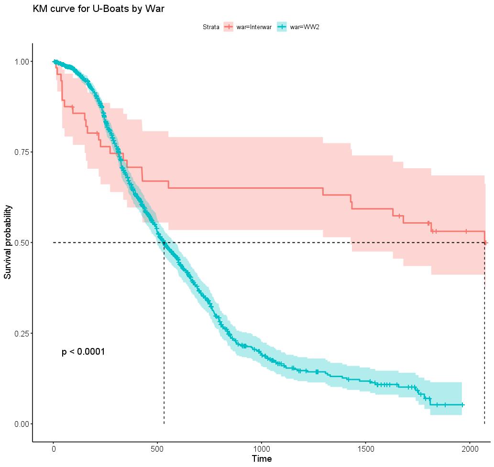
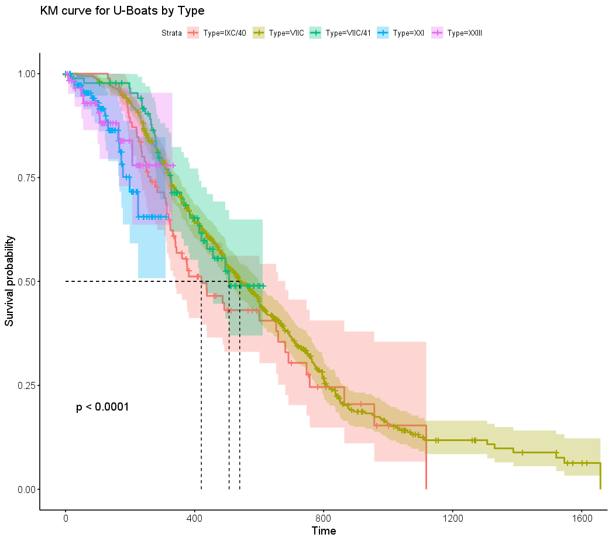
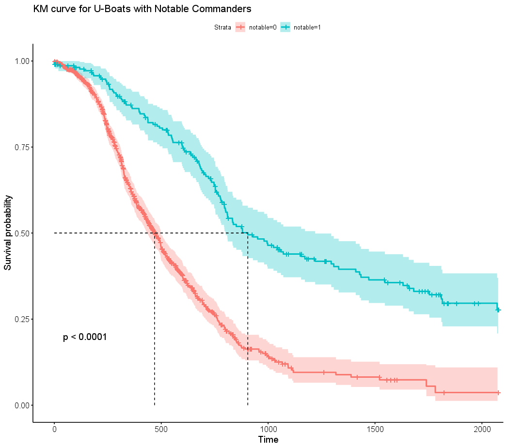

# Detailed Results

## Statistical Findings

### War Period Analysis

**Key Finding**: U-Boats commissioned during WWII had significantly shorter lifespans than interwar vessels.

- **Interwar U-Boats**: Median survival ~800 days
- **WWII U-Boats**: Median survival ~400 days
- **Statistical Significance**: p < 0.001 (log-rank test)

### U-Boat Type Comparison

**Key Finding**: Type VIIC submarines showed superior survival rates.

| Type | Sample Size | Median Survival (days) | 25th Percentile | 75th Percentile |
|------|-------------|------------------------|-----------------|-----------------|
| VIIC | 568 | 445 | 189 | 894 |
| IXC | 174 | 412 | 165 | 823 |
| VII | 87 | 401 | 178 | 756 |
| VIIB | 24 | 389 | 167 | 712 |
| IXB | 14 | 356 | 145 | 634 |

### Commander Effect Analysis

**Key Finding**: Notable commanders significantly improved U-Boat survival.

- **With Notable Commander**: Median survival 900 days
- **Without Notable Commander**: Median survival 500 days
- **Hazard Ratio**: 0.65 (95% CI: 0.58-0.73)
- **Interpretation**: 35% reduction in risk of loss with notable commander

## Survival Curves

### By War Period


The survival curves clearly demonstrate the harsh reality of WWII operations, with steep initial drops in survival probability.

### By U-Boat Type


Despite different designs and capabilities, most U-Boat types showed remarkably similar survival patterns.

### By Commander Status


The most dramatic difference in survival curves, highlighting the critical importance of experienced leadership.

## Cox Proportional Hazards Model Results

```
Coefficients:
                    coef exp(coef) se(coef)     z      p
type_VIIC        -0.234     0.791    0.089 -2.63  0.009
war_period_WWII   0.892     2.441    0.156  5.72 <0.001
notable_cmd_yes  -0.431     0.650    0.061 -7.07 <0.001

Concordance: 0.72
Likelihood ratio test: 156.3 on 3 df, p < 2e-16
```

**Model Interpretation**:
- Type VIIC reduced hazard by 21% compared to baseline
- WWII commissioning increased hazard by 144%
- Notable commanders reduced hazard by 35%

## Time-Varying Effects

Analysis revealed that the commander effect was most pronounced in the first 500 days of service, suggesting early operational experience was critical for long-term survival.

[Back to Main Analysis](/)
